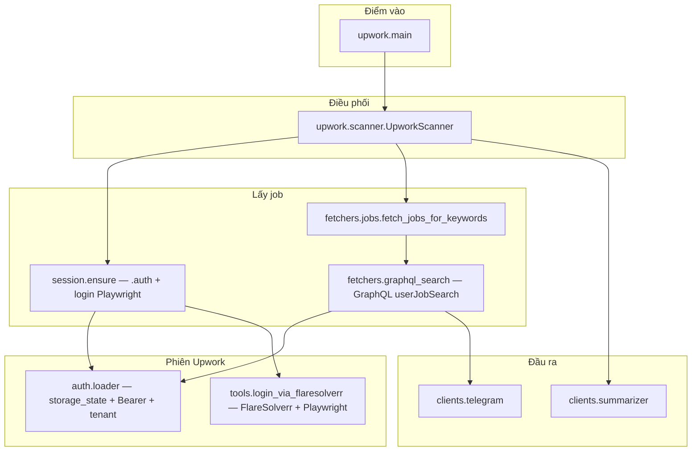

# Kiến trúc tổng thể — Upwork Scanner

## Luồng nghiệp vụ

1. **`main`** đọc `Config`, khởi tạo store + Telegram + summarizer, chạy `UpworkScanner.run_forever`.
2. **Scanner** mỗi vòng: đồng bộ subscriber → **`ensure_graphql_session`** (thiếu `.auth` + có email/password → login) → **GraphQL fetch** → lọc job mới → tóm tắt → Telegram → `seen`.

## Fetch (chỉ GraphQL)

| `UPWORK_FETCH_MODE` | Hành vi |
|---------------------|---------|
| `graphql` / `auto` / (cũ) `html` | Luôn dùng **GraphQL** (`html` chỉ còn cảnh báo log). |

Thư mục auth: **`UPWORK_AUTH_DIR`** hoặc `<repo>/.auth/`.

## Module

| Module | Trách nhiệm |
|--------|-------------|
| `config` | Env → `Config` |
| `auth.loader` | `storage_state.json`, `auth_config.json`, Bearer |
| `fetchers.scrape` | Chỉ dùng cho script/curl_cffi thủ công, **scanner không gọi** |
| `fetchers.keyword` | Keyword/URL → `userQuery` |
| `fetchers.graphql_search` | Giống `debug_upwork_graphql/graphql_via_flaresolverr.py` + retry 403 |
| `fetchers.jobs` | Chỉ gọi `fetch_jobs_graphql` |
| `session.ensure` | Thiếu `storage_state` + có email/password → login subprocess, `UPWORK_LOGIN_FORM=1` theo config |
| `tools.login_via_flaresolverr` | Lưu `UPWORK_AUTH_DIR` / `storage_state.json` + `auth_config.json` |
| `scanner` | `ensure_graphql_session` + `fetch_jobs_for_keywords` |

## Dữ liệu tĩnh

- `upwork/data/userJobSearch_body.json` — body đầy đủ.
- `upwork/data/postman_userJobSearch_body.minimal.json` — khi `UPWORK_GRAPHQL_MINIMAL=1`.

## Retry 403

- `UPWORK_GRAPHQL_403_MAX_RETRIES` (mặc định 3): 403 / Challenge / OAuth → login lại → GraphQL lại. Cần `UPWORK_EMAIL` / `UPWORK_PASSWORD`.

## Cài đặt

- `pip install playwright && playwright install chromium`, `FLARESOLVERR_URL`, `UPWORK_SEARCH_KEYWORD`, `UPWORK_EMAIL` / `UPWORK_PASSWORD` (lần đầu hoặc refresh phiên).
