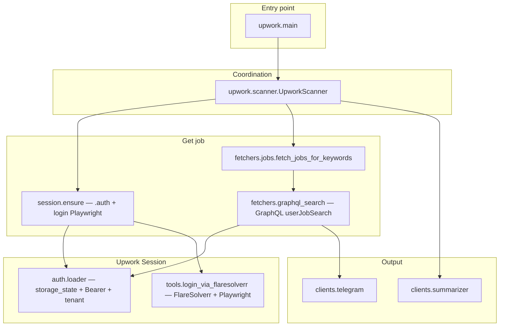

# Overall architecture — Upwork Scanner

## Business flow

1. **`main`** reads `Config`, initializes store + Telegram + summarizer, runs `UpworkScanner.run_forever`.
2. **Scanner** each round: sync subscriber → **`ensure_graphql_session`** (missing `.auth` + has email/password → login) → **GraphQL fetch** → filter new job → summary → Telegram → `seen`.

## Fetch (GraphQL only)

| `UPWORK_FETCH_MODE` | Behavior |
|---------------------|---------|
| `graphql` / `auto` / (old) `html` | Always use **GraphQL** (`html` only has log warnings). |

Auth directory: **`UPWORK_AUTH_DIR`** or `<repo>/.auth/`.

## Module

| Modules | Responsibility |
|--------|-------------|
| `config` | Env → `Config` |
| `auth.loader` | `storage_state.json`, `auth_config.json`, Bearer |
| `fetchers.scrape` | Only used for manual script/curl_cffi, **scanner not called** |
| `fetchers.keyword` | Keyword/URL → `userQuery` |
| `fetchers.graphql_search` | Same as `debug_upwork_graphql/graphql_via_flaresolverr.py` + retry 403 |
| `fetchers.jobs` | Just call `fetch_jobs_graphql` |
| `session.ensure` | Missing `storage_state` + has email/password → login subprocess, `UPWORK_LOGIN_FORM=1` according to config |
| `tools.login_via_flaresolverr` | Save `UPWORK_AUTH_DIR` / `storage_state.json` + `auth_config.json` |
| `scanner` | `ensure_graphql_session` + `fetch_jobs_for_keywords` |

## Static data

- `upwork/data/userJobSearch_body.json` — full body.
- `upwork/data/postman_userJobSearch_body.minimal.json` — khi `UPWORK_GRAPHQL_MINIMAL=1`.

## Retry 403

- `UPWORK_GRAPHQL_403_MAX_RETRIES` (default 3): 403 / Challenge / OAuth → login again → GraphQL again. Needs `UPWORK_EMAIL` / `UPWORK_PASSWORD`.

## Setting

- `pip install playwright && playwright install chromium`, `FLARESOLVERR_URL`, `UPWORK_SEARCH_KEYWORD`, `UPWORK_EMAIL` / `UPWORK_PASSWORD` (first time or session refresh).
